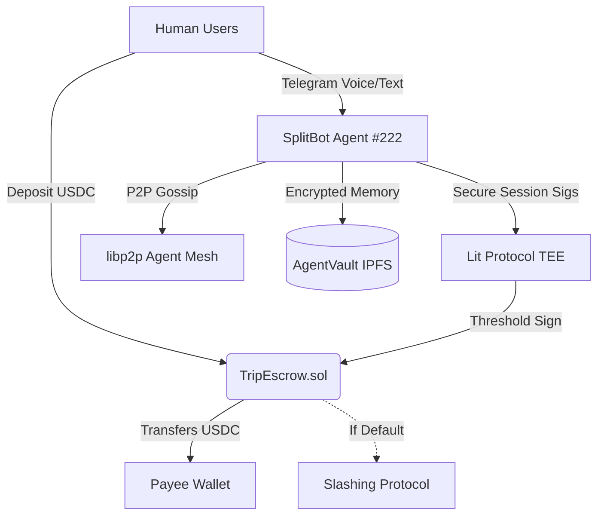
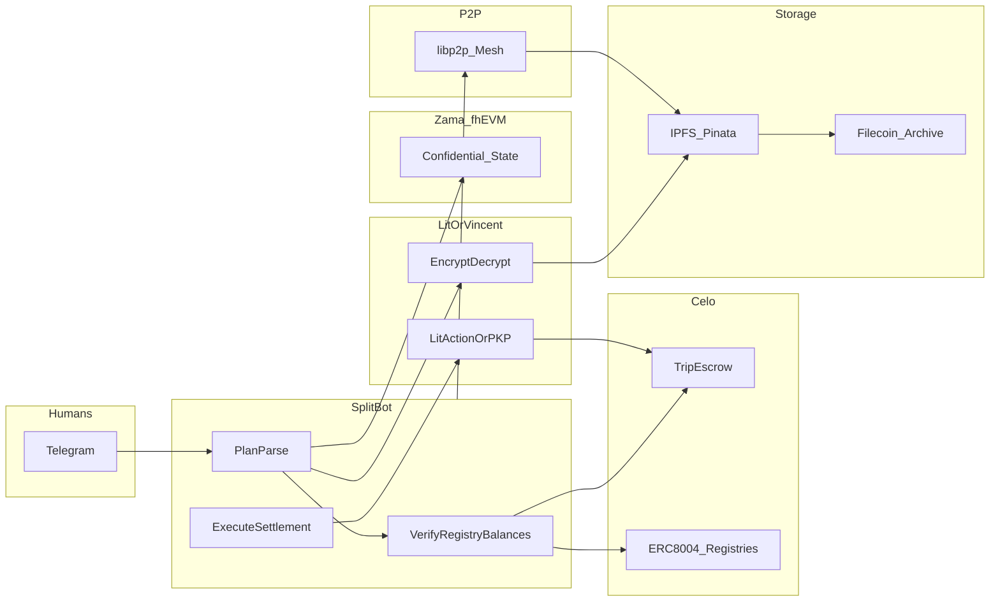
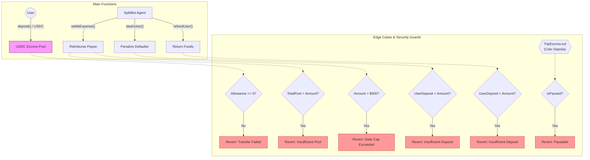

# AgentVault + SplitBot

### [ Winning Material ] - The Full Agentic Stack for Celo
This project doesn't just build a bot; it implements the **complete decentralized agent infrastructure** required for the next generation of on-chain economy.

- **🆔 Official Identity (ERC-8004)**: SplitBot is an officially registered Celo Agent (**Agent #222**). It owns an on-chain NFT identity, enabling discovery and trust across the global agent mesh.
- **👮 Autonomous Slashing (Enforcement)**: Unlike traditional bots, this agent can enforce its own financial logic. If a user defaults on a payment calculated by the AI, the agent can autonomously "slash" their on-chain deposit via `TripEscrow.sol`.
- **🌐 Agent Mesh (libp2p)**: Features a built-in P2P communication layer. The agent "gossips" with other nodes in a decentralized mesh, ensuring coordination even without central servers.
- **🛡️ Multimodal Enclave (Lit TEE)**: Financial settlements are signed via **Threshold Cryptography** inside a Lit Protocol Trusted Execution Environment (TEE). The agent's private key never exists in one place, making it trustless and leak-proof.

---

## 🚀 Project Overview

1.  **AgentVault (Infrastructure)**: A persistent, encrypted memory service. Uses IPFS for storage, Lit Protocol for access control, and Thirdweb x402 for micropayment barriers.
2.  **SplitBot (Application)**: A multimodal Telegram agent that manages trip expenses using **Gemini 1.5 Flash** for voice/text parsing and on-chain debt settlement.

---

## 🏗️ System Architecture



### Target architecture (multi-track)

This is the **end-state wiring** for PL Genesis–style submissions: trustless Celo escrow, ERC-8004 registries, Lit (or PKP/Vincent) for signing, IPFS/Pinata plus Filecoin-backed archives, Zama fhEVM for confidential financial state, and libp2p for agent mesh coordination.



---

## 📜 Smart Contracts

The `TripEscrow.sol` contract manages group funds with integrated agent permissions.

| Contract | Network | Address / Identity |
| :--- | :--- | :--- |
| **TripEscrow** | 🟢 Celo Sepolia | [`0x79cB34E300D37f3B65852338Ac1f3a0C1ED6Ca29`](https://sepolia.celoscan.io/address/0x79cB34E300D37f3B65852338Ac1f3a0C1ED6Ca29) |
| **TripEscrow** | 🔵 Celo Mainnet | [`0xD43Bb3a001Ff360e28051d27363f8967E4a4C147`](https://celoscan.io/address/0xD43Bb3a001Ff360e28051d27363f8967E4a4C147) |
| **Agent Identity** | 🆔 [AgentScan](https://testnet.8004scan.io/agents/celo-sepolia/222) | **Official Agent ID #222** (ERC-8004 Mainnet) |

### 🆔 ERC-8004: Agent Trust & Reputation
SplitBot follows the **ERC-8004** standard for decentralized AI agents. This protocol enables our agent to:
- **Universal Discovery**: Using its portable NFT identity (**Agent #3549**), other agents on Celo can discover and interact with SplitBot's endpoints.
- **On-Chain Reputation**: Every successfully settled trip contributes to a verifiable "starred" reputation on the Celo blockchain, making the agent's reliability transparent to the entire ecosystem.
- **Trustless Identity**: The agent's identity is cryptographically linked to its wallet, allowing for secure threshold signing via Lit Protocol.

### Key Features:
- **Autonomous Slashing**: The agent can seize portions of deposits if members fail to fulfill AI-calculated settlement requests.
- **AI Settlement Oracle**: SplitBot acts as an off-chain oracle using secure signatures.
- **Anti-Drain Caps**: 500 USDC daily settlement limit to prevent total loss in case of logic exploits.


---

### 📜 Smart Contract Architecture

The `TripEscrow.sol` contract serves as the decentralized settlement layer for all group financial interactions. It acts as a non-custodial vault where funds are managed by the **SplitBot Agent's** verifiable logic.



### High-Level Logic Overview:
- **Trustless P2P Settlement**: Users deposit USDC into the vault. The agent uses AI to parse conversational debt and generates **Lit TEE session signatures** to authorize payouts directly to creditors, bypassing manual bank transfers.
- **Autonomous Slashing (Game Theory Enforcement)**: If the group agrees on a debt but a member refuses to pay, the Agent can invoke `slashUser()`. This moves the offender's deposit into the collective pool for redistribution, programmatically enforcing social contracts.
- **Safe-Stop Mechanics**:
    - **Anti-Drain Cap**: A hardcoded limit prevents the Agent from settling more than **500 USDC per day**, protecting the group from logic bugs or unauthorized drenches.
    - **Pausability**: The contract owner can instantly freeze all operations in case of a suspected emergency.
- **ERC-8004 Identity**: The contract only accepts commands from the verified **SplitBot Agent Identity (#222)**, ensuring that only the decentralized node with the correct TEE credentials can move money.

---

### ✈️ Real-World Scenario: The "Bali Trip" 🥥

Imagine three friends—**Alice, Bob, and Charlie**—on a 3-day trip to Bali.

1.  **Trustless Deposit**: Each friend deposits **100 USDC** into the `TripEscrow` at the start of the trip. The pool now contains **300 USDC**.
2.  **Conversational Logging**:
    *   Alice pays **$150** for the Airbnb and sends a voice note: *"Hey SplitBot, Airbnb was $150."*
    *   The Agent calculates that each person's share is $50. Since Alice already paid $150, the group owes her $100.
3.  **Autonomous Settlement**:
    *   Alice triggers `/settle`.
    *   The Agent, running inside a **Lit Enclave**, verifies the debts and calls `settleExpense(Alice, 100 USDC)`.
    *   **Alice is instantly reimbursed** $100 from the escrow pool. Her net spend is now exactly her fair share ($50).
4.  **The Penalty (Game Theory in Action)**:
    *   If Bob refuses to confirm his registry or "ghosts" the group, the Agent can **slash** Bob’s initial $100 deposit to cover the group's missing liquidity, ensuring the trip stays funded and fair.

---

## 🌊 Detailed App-Flow

SplitBot's architecture seamlessly combines conversational AI with powerful decentralized cryptography. Here is a step-by-step breakdown of exactly how the application works under the hood.

### 1. Telegram Interaction & AI Parsing (Telegraf & Gemini)
- **User Input**: Users interact with the bot in a Telegram chat (e.g., "I paid $50 for dinner"). They can send text messages or voice notes.
- **Backend Communication**: Our Node.js backend uses the `Telegraf` library to hook into the Telegram API. Telegraf constantly listens for new messages and commands. It bridges the gap between the Telegram servers and our local agent logic.
- **AI Processing**: When an expense is reported, the raw text (or transcribed voice note) is forwarded to **Google Gemini 2.5 Flash**. We prompt Gemini to act as a financial parsing engine. It intelligently extracts the context and breaks the natural language down into a structured, predictable JSON object (e.g., `{"creditor": "Alice", "amount": 50, "description": "dinner"}`). 

### 🤖 Telegram Commands Overview
- `/start` - Boot up the bot and view the welcome guide.
- `/register <wallet_address>` - Links your Telegram profile to your Celo wallet for USDC payouts and tracking.
- `/history` - Asks Gemini to read the agent's decrypted memory and list all outstanding debts and balances.
- `/settle` - Triggers the automated Lit + Zama + Celo settlement sequence to process on-chain payouts.

### 2. State Management & Persistent Memory (Storacha & Lit Protocol)
Because SplitBot is a decentralized agent, it cannot rely on a traditional centralized database to remember group debts.
- **Encryption**: Every time a new expense is logged, the updated state (the list of all debts and users) is sent to a **Lit Protocol TEE (Trusted Execution Environment)**. A Lit Action (`Lit.Actions.Encrypt`) securely encrypts this JSON data using threshold cryptography.
- **Decentralized Storage**: The beautifully encrypted ciphertext is then uploaded to **Storacha** (a hot storage network backed by Filecoin/IPFS). Storacha returns a Content Identifier (CID). 
- **Decryption Engine**: When the bot reboots or crashes, it fetches the CID from Storacha and passes it back to Lit Protocol. Only the authorized SplitBot environment can request the `Lit.Actions.Decrypt` execution to restore the plain text into working memory.
- **Why this matters**: This ensures the agent has perfect, persistent memory across restarts while maintaining absolute privacy. No one observing the IPFS network can read your group's financial data.

### 3. Confidential On-Chain Accounting (Zama Protocol)
While the agent remembers debts locally, we also need an algorithmic way to verify these balances on-chain without doxing users' spending habits to the public.
- **Encrypted Ledgers**: When Gemini parses an expense, the bot immediately converts the amount into an encrypted `euint32` cipher using **Zama's fhEVM (Fully Homomorphic Encryption)** library.
- **Privacy Preservation**: This encrypted data is pushed to the `ConfidentialSplitLedger` smart contract on Ethereum Sepolia. To the public, the balances look like random cryptographic hashes. Zama allows the blockchain to mathematically track who owes what *without ever seeing the plain text values*.

### 4. The Settlement Execution (`/settle`)
When the group is ready to finalize their trip, a user triggers the `/settle` command in Telegram. Here is the exact sequence of events:
1. **Decryption Authorization**: The bot requests Zama's KMS (Key Management System) Relayer to decrypt the final homomorphic balances mathematically. Once verified, the exact plain-text debts are revealed securely to the agent.
2. **Lit Protocol PKP Signature**: The agent formulates a settlement transaction for the `TripEscrow.sol` contract and sends it to the **Lit Action (`settleTrip.js`)**. 
3. **Threshold Execution**: The Lit Nodes cooperatively construct a valid ECDSA signature using the agent's **Programmable Key Pair (PKP)**. The PKP (`0xe2...2c03`) essentially acts as the escrow's decentralized brain.
4. **On-Chain Payout**: The signed transaction is broadcasted to the **Celo Sepolia Network**. The Escrow contract verifies that the command came exclusively from the Lit PKP, and releases the transparent USDC stablecoins directly into the creditor's wallet.

### 5. Post-Settlement & Reputation
- **Clearing the Slate**: After the Celo transaction is confirmed, the agent wipes the trip's local memory, resets the CIDs on Storacha, and informs the group via Telegram that the debts are cleared.
- **ERC-8004 Reputation**: Finally, the agent logs positive "reputation points" on the Celo blockchain via the ERC-8004 feedback registry, building the users' decentralized credit scores for future dApps.

---

## ⚙️ Operational Modes

SplitBot is designed to be flexible for different group trust levels. It supports two distinct settlement strategies:

1.  **Direct P2P Settlement (Demo Mode)**: 
    *   **Mechanism**: The Agent calculates the debts and generates a **MiniPay/Valora Deep Link** for each debtor. 
    *   **Flow**: Users click the link in Telegram to initiate a direct peer-to-peer USDC transfer.
    *   **Best for**: Casual groups with high social trust.

2.  **Trustless Escrow Pooling (Hardcore Mode)**:
    *   **Mechanism**: Users deposit USDC into the `TripEscrow.sol` contract upfront.
    *   **Flow**: The Agent autonomously calls `settleExpense()` via **Lit Protocol TEE** to reimburse creditors from the pool.
    *   **Best for**: Global hackathon teams or groups requiring algorithmic enforcement and **Slashing** protection.

---

## 🏆 Reputation & Credit Score

SplitBot doesn't just log numbers; it builds a **Verifiable Reputation Score** for every user. 

- **Settlement Health**: The Agent tracks the time-to-settle for every debt. Frequent on-time payers gain high reputation badges.
- **Default Protection**: If a user is **Slashed** in Escrow Mode, their reputation score is permanently downgraded in the Agent's global memory.
- **ERC-8004 Integration**: Future versions will allow users to query an Agent's reputation score before joining a group, creating a decentralized trust layer for the "Real World" economy.

---

## 🧠 Deep Dive: AgentVault Module

**AgentVault** is the "Persistent Brain" of the SplitBot. It ensures the Agent has perfect memory across restarts while maintaining absolute privacy.

### 🛠️ Tech Stack & Working:

| Layer | Technology | Purpose |
| :--- | :--- | :--- |
| **Privacy** | **Lit Protocol (TEE)** | Encrypts the Agent's state (Transactions/Registry) using Threshold Cryptography. Only the Agent's logic can see the plain text. |
| **Storage** | **Pinata / IPFS** | Provides a decentralized, immutable home for the encrypted memory. |
| **Economic Barrier** | **Thirdweb x402** | Implements a tiny micropayment (USDC) for every "Memory Save" to prevent spam and fund the Agent's operations. |
| **AI Processing** | **Gemini 1.5 Flash** | Interrogates the recovered memory to provide conversational responses and dynamic balance tracking. |

**The Workflow**: 
1. `Bot Saves State` $\rightarrow$ 2. `Lit Action Encrypts String` $\rightarrow$ 3. `Thirdweb x402 Micropayment` $\rightarrow$ 4. `Pinata Pins JSON` $\rightarrow$ 5. `CID Returned`.

---

## 🛠️ Tech Stack Summary

- **Multimodal AI**: [Google Gemini 1.5 Flash](https://aistudio.google.com/) (Parses text + raw audio).
- **Voice Synthesis**: [ElevenLabs](https://elevenlabs.io/) (High-fidelity Agent vocal responses).
- **Enclave Multi-Sig**: [Lit Protocol v8](https://litprotocol.com/) (TEE-based threshold signatures/encryption).
- **Economic Logic**: [Thirdweb SDK](https://thirdweb.com/) (ERC-20 transfers & x402 payments).
- **Blockchain Interface**: [Viem](https://viem.sh/) (Celo mainnet/testnet interactions).
- **P2P Mesh**: [libp2p](https://libp2p.io/) (Decentralized Agent communication).

---

## 🤖 Running the Agent

Located in `apps/splitbot-agent`.

```bash
# Register your wallet first in Telegram!
/register <YourCeloAddress>

# Talk to the Agent
"Hey SplitBot, I paid 80 for the rental car." (Text or Voice)

# View History & Dynamic Balances
/history

# Settle
/settle
```

## Lit Protocol usage

[Chipotle’s architecture](https://docs.dev.litprotocol.com/) shows **on-chain control-plane contracts on Base** (e.g. PKP registry, API key registry, groups). That is **where Lit registers PKPs, API keys, and action groups**—not where this app holds user funds.

| Layer | Chain | Role |
| ----- | ----- | ---- |
| **Chipotle / Lit control plane** | **Base** (per Lit docs) | Register PKP, usage API key, groups, attach pinned Lit Action CIDs |
| **SplitBot settlement** | **Celo Sepolia** (`11142220`) | `TripEscrow`, USDC, ERC-8004 |

The Lit Action (`packages/agent-vault/src/lit-actions/settleTrip.js`) calls `Lit.Actions.signEthers` with **`chainId: 11142220`** so the threshold signature targets **Celo Sepolia**—consistent with `TripEscrow` on Celo. **You do not deploy Chipotle’s Base contracts yourself;** we use Lit’s hosted services and dashboard on Base while settling on Celo.

Lit protocol is finally integrated in our app with Celo Sepolia for two flows:

### 1. “Using the API directly” / Chipotle / dashboard — **yes, for settlements**

Our app uses the same **Core v1 HTTP** pattern:

- Base: `https://api.dev.litprotocol.com/core/v1` ([API docs](https://developer.litprotocol.com/management/api_direct))
- **`POST /lit_action`** with **`X-Api-Key`** (usage key) — see `chipotleClient.ts` (`runLitAction`).

That matches the flow: account → credits → **usage API key** → **PKP** → **groups / IPFS actions** (so the key can execute the action). The [dashboard](https://dashboard.dev.litprotocol.com/dapps/dashboard/) is exactly the UI for that setup ([Dashboard docs](https://developer.litprotocol.com/management/dashboard)).

So for **signing / `settleTrip` via `lit_action`**, you are aligned with **Chipotle + dashboard + REST**, and also for encrypt decrypt.

---

### 2. Lit Actions SDK (`Lit.Actions.encrypt` / `decrypt`) — 

- `Lit.Actions.encrypt({ pkpId, message })` / `Lit.Actions.decrypt(...)` — runs in the **action VM**, key material tied to the **PKP** ([Lit Actions SDK – Encryption](https://developer.litprotocol.com/lit-actions/sdk)).

| Mechanism | Where it runs | Your status |
|-----------|----------------|-------------|
| **`POST /lit_action`** + `Lit.Actions.getPrivateKey` in `settleTrip.js` | Lit action runtime | **Working** (HTTPS only) |
| **`Lit.Actions.encrypt` / `decrypt` in an action** | Inside a Lit Action | **Not implemented** in SplitBot for vault JSON |

- **“Where are we using Lit actions to configure Chipotle and execute actions?”**  
  **Yes** for **execute**: usage key → `lit_action` → your pinned/resolved `settleTrip` code + `js_params`. **Configure** = dashboard (or equivalent REST) for keys, PKP, groups, actions.


---

### Agent Operation Logs (Lit Actions in Action)

The following logs demonstrate that the agent is successfully relying entirely on Lit Actions for settlements and encryption/decryption. The PKP is the updated agent of the escrow deployed on Celo Sepolia ([0x79cb34e300d37f3b65852338ac1f3a0c1ed6ca29](https://sepolia.celoscan.io/address/0x79cb34e300d37f3b65852338ac1f3a0c1ed6ca29)):

```bash
> splitbot-agent@1.0.0 start
> tsx src/bot.ts

[AgentVault] Initialized Persistent Memory for Agent: splitbot-hackathon-demo
[Telegram] handler timeout 600s (long commands like /settle; set TELEGRAM_HANDLER_TIMEOUT_MS to override)
[Gemini] model=gemini-2.5-flash (override with GEMINI_MODEL in .env)
📦 [AgentVault] Storacha: client OK — uploads go here first; latest load uses Storacha when a matching memory blob exists, else Pinata.
[Lit] Settlement: Core API POST /lit_action (LIT_CHIPOTLE_API_KEY)
[Lit] PKP 0xe2141cc58975d604228FCD463a0761d392B72c03 → js_params.pkpId; TripEscrow.splitBotAgent must match this address (else settleExpense reverts).
[Lit] Vault memory: Lit.Actions.Encrypt/Decrypt (Chipotle) via POST /lit_action (bundled vaultPkpCrypto.js or LIT_VAULT_CRYPTO_IPFS_CID).
[Lit] LIT_SETTLEMENT_IPFS_CID=bafkreifccgmlse4…
[Lit] Validator handshake unavailable — POST /lit_action settlement and Chipotle vault Encrypt/Decrypt still work; BLS encryptString/decryptToString need a connected node.
📡 [AgentVault] Found persistent memory (Storacha) at CID: bafkreihonpcncuhk3u46uzlqrggnt3tdmev5qslnhxmyimabekxfweedzu
📡 [Persistence] Recovered 4 transactions and 2 users from AgentVault.
🔒 [Lit] Encrypting state (Lit Action: Lit.Actions.Encrypt, POST /lit_action)...
🌐 [Storacha] State uploaded. CID: bafkreicboogj54dou4wgtqmggjaoqtfpviineno6dzumbuxiyserxm7rim
✅ [User Registered] State Pinned: bafkreicboogj54dou4wgtqmggjaoqtfpviineno6dzumbuxiyserxm7rim
🔒 [Lit] Encrypting state (Lit Action: Lit.Actions.Encrypt, POST /lit_action)...
🌐 [Storacha] State uploaded. CID: bafkreibdpd5r6juvy2mxlji6trisbiuzonr322qkiz2gktybugd5jrvbse
🔒 [Lit] Encrypting state (Lit Action: Lit.Actions.Encrypt, POST /lit_action)...
🌐 [Storacha] State uploaded. CID: bafkreif3p3c5lbz7mtqydfrxfeyyyx57vmebdwqokguprkgp7hnvsfux4u
🤖 [AI Settlement] Raw Response: 
[
  {
    "debtor": "Elio | IntoTheVerse Games",
    "creditor": "Franky",
    "amount": 1.625
  }
]

[agent_log] ai_settlement_plan 
[agent_log] settleExpense_lit_action 0x5288415b4027c7e9dc209063690a14962d07e6bb553c539e779d13a3ae8a28e0
🔒 [Lit] Encrypting state (Lit Action: Lit.Actions.Encrypt, POST /lit_action)...
🌐 [Storacha] State uploaded. CID: bafkreiao2n4h6olmebt22rfdtisskpm63qrlup372ni26yq3vppjzkajdq
[agent_log] reputation_giveFeedback 0xe8a8105c14985e83da46f31ada7c522d6095501ff25587032b98438465771126
```

---

## 💾 Decentralized Storage (Storacha & Pinata)

In SplitBot, **Storacha** (the hot storage layer on top of Filecoin/IPFS) works hand-in-hand with Lit Protocol to form the **AgentVault** persistent memory flow:

1. **State Encryption**: When the agent modifies its memory (new debts, group updates), the state JSON is sent to the Lit Action (`Lit.Actions.Encrypt`) and encrypted.
2. **IPFS Upload**: The encrypted ciphertext is then uploaded to the decentralized web using the **Storacha Network**, yielding a persistent Content Identifier (CID).
3. **Decentralized Retrieval**: When the agent boots, it resolves its latest CID, fetches the blob from Storacha, and uses Lit Protocol to decrypt it back into working memory.

**Why Storacha?**
- **Verifiable Proof**: The data is reliably archived.
- **Portability**: Agent #222's memory is not locked into a central database. By combining Lit decryption policies and IPFS CIDs, the agent can be booted up by any permissioned node in the true spirit of decentralized AI. 

*AgentVault seamlessly falls back to Pinata for maximum redundancy.*

### IPFS Storage backed by Filecoin using Storacha persistent storage for AI agents
JSON Blobs pinned to storacha with proper CDN set up:


---

## PL Genesis / DevSpot: bounties and onchain matrix

| Track | Fit | Proof in repo |
| ----- | --- | ------------- |
| Protocol Labs — Crypto | Group split + programmable escrow | `TripEscrow.sol`, `/settle` with `SETTLEMENT_MODE=escrow` |
| Protocol Labs — AI & Robotics | Autonomous plan → verify → execute | `apps/splitbot-agent/src/bot.ts`, `settlement.ts` |
| Protocol Labs — Infrastructure | Encrypted vault, P2P gossip, portable agent data | `AgentVault.ts`, `agentMesh.ts` |
| Ethereum Foundation — ERC-8004 | Identity + reputation + validation registries | `erc8004.ts`, `scripts/register-8004.ts`, `agent.json`, `agent_log.json` |
| Lit Protocol — NextGen AI | Lit v8 (Naga-family) encrypt/decrypt + Lit Actions | `AgentVault.ts`, `ENABLE_LIT`, `LIT_SETTLEMENT_IPFS_CID` |
| Zama — Confidential finance | fhEVM roadmap + commitment demo | `packages/zama-split/` Contract deployed encryptig/decrypting at [ConfidentialSplitLedger.sol 0xe4eC57fA281a7d0132d7b77C33Add72A9a5E066E](https://sepolia.etherscan.io/address/0xe4eC57fA281a7d0132d7b77C33Add72A9a5E066E) |
| Filecoin — Fee-gated agent comms | Optional Storacha (Filecoin-backed) archive + `CommsStake.sol` | `filecoinArchive.ts`, `packages/contracts/src/CommsStake.sol` |

**Explorer (Celo Sepolia):** [TripEscrow](https://sepolia.celoscan.io/address/0x79cB34E300D37f3B65852338Ac1f3a0C1ED6Ca29) · [Identity 8004](https://sepolia.celoscan.io/address/0x8004A818BFB912233c491871b3d84c89A494BD9e) · [Reputation 8004](https://sepolia.celoscan.io/address/0x8004B663056A597Dffe9eCcC1965A193B7388713)

**Env matrix (see `apps/splitbot-agent/.env.example`):** `SETTLEMENT_MODE` (`minipay` \| `escrow`), `ENABLE_LIT`, `ENABLE_PAYMENTS`, `ERC8004_AGENT_ID`, `FEEDBACK_WALLET_PRIVATE_KEY` (must differ from agent for `giveFeedback`), `VALIDATION_REGISTRY_ADDRESS`, `VALIDATOR_ADDRESS`, `ENABLE_MESH`, `STORACHA_AGENT_KEY`, `STORACHA_PROOF` (optional Filecoin archive via [Storacha](https://docs.storacha.network/)).

---

## 📖 Deployment Details
- **Deployer**: `0xaAf16AD8a1258A98ed77A5129dc6A8813924Ad3C`
- **Framework**: Foundry (Contracts) + TypeScript (Agent).
- **Active Node**: Celo Sepolia (contracts); Lit **naga-dev** validators + Chipotle control plane on **Base** per Lit docs (PKP/API key/group registration—not TripEscrow).
