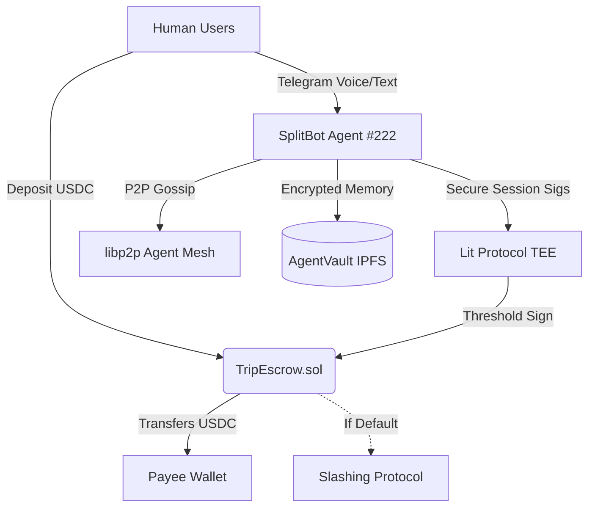

# 🌟 Celo Hackathon: AgentVault + SplitBot

### [ Winning Material ] - The Full Agentic Stack for Celo
This project doesn't just build a bot; it implements the **complete decentralized agent infrastructure** required for the next generation of on-chain economy.

- **🆔 Official Identity (ERC-8004)**: SplitBot is an officially registered Celo Agent (**Agent #222**). It owns an on-chain NFT identity, enabling discovery and trust across the global agent mesh.
- **👮 Autonomous Slashing (Enforcement)**: Unlike traditional bots, this agent can enforce its own financial logic. If a user defaults on a payment calculated by the AI, the agent can autonomously "slash" their on-chain deposit via `TripEscrow.sol`.
- **🌐 Agent Mesh (libp2p)**: Features a built-in P2P communication layer. The agent "gossips" with other nodes in a decentralized mesh, ensuring coordination even without central servers.
- **🛡️ Multimodal Enclave (Lit TEE)**: Financial settlements are signed via **Threshold Cryptography** inside a Lit Protocol Trusted Execution Environment (TEE). The agent's private key never exists in one place, making it trustless and leak-proof.

---

## 🚀 Project Overview

1.  **AgentVault (Infrastructure)**: A persistent, encrypted memory service. Uses IPFS for storage, Lit Protocol for access control, and Thirdweb x402 for micropayment barriers.
2.  **SplitBot (Application)**: A multimodal Telegram agent that manages trip expenses using **Gemini 1.5 Flash** for voice/text parsing and on-chain debt settlement.

---

## 🏗️ System Architecture



---

## 📜 Smart Contracts

The `TripEscrow.sol` contract manages group funds with integrated agent permissions.

| Contract | Network | Address |
| :--- | :--- | :--- |
| **TripEscrow** | Celo Sepolia | `0x79cB34E300D37f3B65852338Ac1f3a0C1ED6Ca29` |
| **Agent Identity** | Celo Sepolia | **Agent ID #222** (ERC-8004) |

### Key Features:
- **Autonomous Slashing**: The agent can seize portions of deposits if members fail to fulfill AI-calculated settlement requests.
- **AI Settlement Oracle**: SplitBot acts as an off-chain oracle using secure signatures.
- **Anti-Drain Caps**: 500 USDC daily settlement limit to prevent total loss in case of logic exploits.

---

### 📜 Smart Contract Architecture

The `TripEscrow.sol` contract serves as the decentralized settlement layer for all group financial interactions. It acts as a non-custodial vault where funds are managed by the **SplitBot Agent's** verifiable logic.

```mermaid
graph TD
    User((User))
    Agent[SplitBot Agent]
    Contract{{"TripEscrow.sol<br/>(Celo Sepolia)"}}
    
    subgraph "Main Functions"
        User -->|deposit() / USDC| D[USDC Escrow Pool]
        Agent -->|settleExpense()| S[Reimburse Payee]
        Agent -->|slashUser()| SL[Penalize Defaulter]
        Agent -->|refundUser()| RF[Return Funds]
    end

    subgraph "Edge Cases & Security Guards"
        D -.-> E1{"Allowance == 0?"}
        E1 -->|No| FAIL1[Revert: Transfer Failed]
        
        S -.-> E2{"TotalPool < Amount?"}
        E2 -->|Yes| FAIL2[Revert: Insufficient Pool]
        
        S -.-> E3{"Amount > $500?"}
        E3 -->|Yes| FAIL3[Revert: Daily Cap Exceeded]
        
        SL -.-> E4{"UserDeposit < Amount?"}
        E4 -->|Yes| FAIL4[Revert: Insufficient Deposit]
        
        RF -.-> E5{"UserDeposit < Amount?"}
        E5 -->|Yes| FAIL5[Revert: Insufficient Deposit]
        
        Contract -.-> E6{"isPaused?"}
        E6 -->|Yes| FAIL6[Revert: Pausable]
    end

    style D fill:#f9f,stroke:#333
    style FAIL1 fill:#ff9999,stroke:#b22
    style FAIL2 fill:#ff9999,stroke:#b22
    style FAIL3 fill:#ff9999,stroke:#b22
    style FAIL4 fill:#ff9999,stroke:#b22
    style FAIL5 fill:#ff9999,stroke:#b22
    style FAIL6 fill:#ff9999,stroke:#b22
```

### High-Level Logic Overview:
- **Trustless P2P Settlement**: Users deposit USDC into the vault. The agent uses AI to parse conversational debt and generates **Lit TEE session signatures** to authorize payouts directly to creditors, bypassing manual bank transfers.
- **Autonomous Slashing (Game Theory Enforcement)**: If the group agrees on a debt but a member refuses to pay, the Agent can invoke `slashUser()`. This moves the offender's deposit into the collective pool for redistribution, programmatically enforcing social contracts.
- **Safe-Stop Mechanics**:
    - **Anti-Drain Cap**: A hardcoded limit prevents the Agent from settling more than **500 USDC per day**, protecting the group from logic bugs or unauthorized drenches.
    - **Pausability**: The contract owner can instantly freeze all operations in case of a suspected emergency.
- **ERC-8004 Identity**: The contract only accepts commands from the verified **SplitBot Agent Identity (#222)**, ensuring that only the decentralized node with the correct TEE credentials can move money.

---

---

## 🛠️ Tech Stack

- **Multimodal AI**: [Google Gemini 1.5 Flash](https://aistudio.google.com/) (Parses both text and raw voice memos).
- **Voice Synthesis**: [ElevenLabs](https://elevenlabs.io/) (Agent replies with confirmational voice messages).
- **Enclave Compute**: [Lit Protocol v8 (Naga)](https://litprotocol.com/) (TEE-based threshold signing).
- **Mesh Networking**: [libp2p](https://libp2p.io/) (Agent-to-agent decentralized communication).
- **On-Chain Identity**: [ERC-8004](https://erc8004.org/) (Official Celo Agent Registry).
- **Payments & Storage**: Thirdweb x402 + Pinata IPFS.

---

## 🤖 Running the Agent

Located in `apps/splitbot-agent`.

```bash
# Register your wallet first in Telegram!
/register <YourCeloAddress>

# Talk to the Agent
"Hey SplitBot, I paid 80 for the rental car." (Text or Voice)

# Settle (TEE-Authorized)
/settle
```

---

## 📖 Deployment Details
- **Deployer**: `0xaAf16AD8a1258A98ed77A5129dc6A8813924Ad3C`
- **Framework**: Foundry (Contracts) + TypeScript (Agent).
